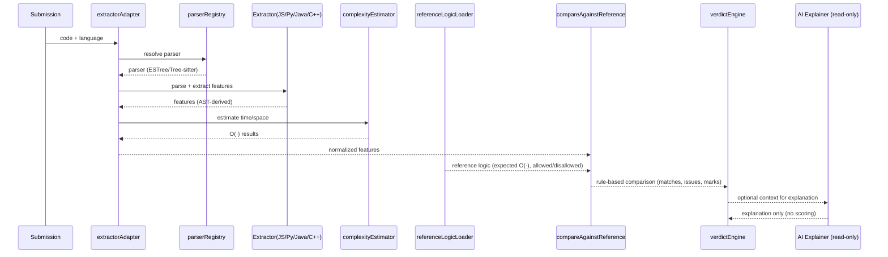

# AST-Based Analysis Architecture (Design)

This folder hosts new, modular AST-based static analysis that preserves determinism, keeps the existing verdict engine unchanged, and outputs a backward-compatible feature vector.

## Goals
- Deterministic AST parsing across Python, C++, Java, JavaScript
- Backward-compatible feature vector (same fields and defaults)
- No AI in decision-making; rule-based only
- Pluggable modules; existing `verdictEngine` unchanged

## Folder Structure
- core/
  - parserRegistry.js — Language→parser mapping; returns deterministic parser functions
  - featureVectorSchema.js — Defines and validates the canonical feature vector shape
  - extractorAdapter.js — Unified `extractFeaturesAST(code, language)` adapter that dispatches to language-specific extractors and normalizes output
- extractors/
  - javascriptExtractor.js — AST traversal for JS (Esprima-based)
  - pythonExtractor.js — AST traversal for Python (stub)
  - cppExtractor.js — AST traversal for C++ (stub)
  - javaExtractor.js — AST traversal for Java (stub)
- utils/
  - walkers.js — AST walking helpers (generic depth-first traversal)
  - counters.js — Reusable counting utilities (loops, conditionals, calls)

## Module Responsibilities
- parserRegistry.js
  - Provide `getParser(language)` that returns `{ parse(code), astKind }`
  - Pin versions for determinism; prefer `web-tree-sitter` for multi-language, fallback to pure JS parsers where needed

- featureVectorSchema.js
  - Export `createDefaultFeatures()` with required fields
  - Export `validateFeatures(obj)` to enforce presence and safe defaults

- extractorAdapter.js
  - Export `extractFeaturesAST(code, language)`
  - Resolve language-specific extractor; if missing, return defaults or defer to legacy regex
  - Ensure fields: counts, booleans, complexity strings, paradigm, length metrics

- extractors/*
  - Implement deterministic AST traversal to populate the feature vector
  - Avoid runtime-based complexity; use structural patterns only
  - Keep naming consistent (`loopCount`, `nestedLoopCount`, etc.)

- utils/*
  - Shared helpers for traversals and counters to avoid duplication

## Integration Notes
- Keep `server/utils/verdictEngine.js` unchanged (uses the feature vector only)
- `server/utils/logicFeatureExtractor.js` can delegate to `extractFeaturesAST` when available, otherwise fallback to regex
- Tests: add per-language tests to verify parity with existing expectations

## Determinism & Maintainability
- Pin parser and grammar versions
- Single adapter API reduces coupling across modules
- Language extractors can evolve independently without breaking the verdict engine or scoring

## System Architecture Diagram

```mermaid
flowchart LR
  subgraph Client
    A[Submit Code]
  end

  subgraph Server
    LFE[logicFeatureExtractor]
    AD[AST Adapter\n(extractorAdapter)]
    PR[parserRegistry]
    EXT[Language Extractors\n(JS/Py/Java/C++)]
    CE[complexityEstimator\n(AST time + space)]
    RLL[referenceLogicLoader]
    COMP[compareAgainstReference]
    VE[verdictEngine]
    AI[(AI Explainer)\nread-only]
  end

  A --> LFE --> AD --> PR --> EXT --> CE --> LFE
  RLL --> COMP --> VE
  LFE -->|features| COMP
  VE -.->|attach explanation| AI

  classDef judge fill:#e3f2fd,stroke:#1565c0,stroke-width:1px
  classDef readonly fill:#fff3e0,stroke:#ef6c00,stroke-width:1px,stroke-dasharray: 3 3
  class LFE,AD,PR,EXT,CE,RLL,COMP,VE judge
  class AI readonly
```

Notes:
- The AI explainer is outside the judgment path: it never affects COMP/VE outputs.
- Reference and submission flow through the same adapter + extractors for fairness.

## Evaluation Pipeline Diagram



Key guarantees:
- Deterministic inputs/outputs, fixed rule order, no randomness.
- Same pipeline for reference and submission.

## Component Diagram

```mermaid
classDiagram
  class extractorAdapter {
    +extractFeaturesAST(code, lang)
  }
  class parserRegistry {
    +getParser(lang)
  }
  class complexityEstimator {
    +estimateTimeComplexityAST(features)
    +estimateSpaceComplexityAST(features)
  }
  class javascriptExtractor
  class pythonExtractor
  class javaExtractor
  class cppExtractor
  class logicFeatureExtractor {
    +extractLogicFeatures(code, lang)
  }
  class referenceLogicLoader {
    +compareAgainstReference(features, qid)
  }
  class verdictEngine
  class aiExplainer <<read-only>>

  extractorAdapter --> parserRegistry
  extractorAdapter --> javascriptExtractor
  extractorAdapter --> pythonExtractor
  extractorAdapter --> javaExtractor
  extractorAdapter --> cppExtractor
  extractorAdapter --> complexityEstimator
  logicFeatureExtractor --> extractorAdapter
  logicFeatureExtractor --> complexityEstimator
  logicFeatureExtractor --> referenceLogicLoader
  referenceLogicLoader --> verdictEngine
  verdictEngine ..> aiExplainer : optional explanation only
```

Separation of concerns:
- Judgment path: extractorAdapter → complexityEstimator → referenceLogicLoader → verdictEngine.
- AI explainer sits outside, receives a copy of results, and cannot alter scores or verdicts.
